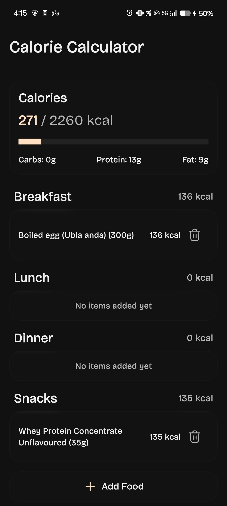
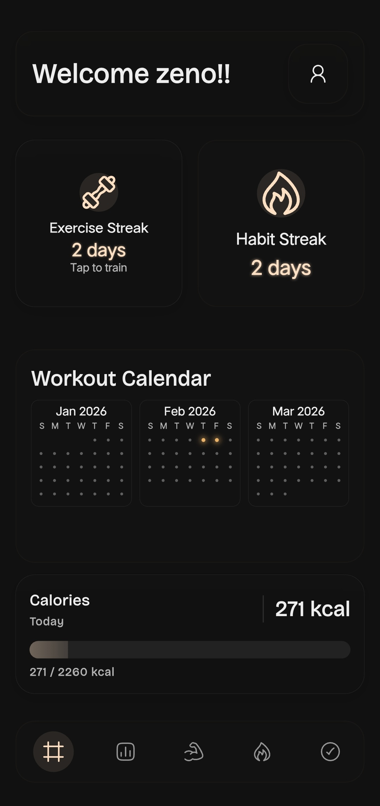
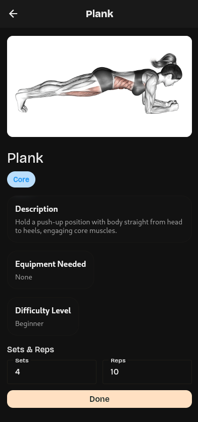
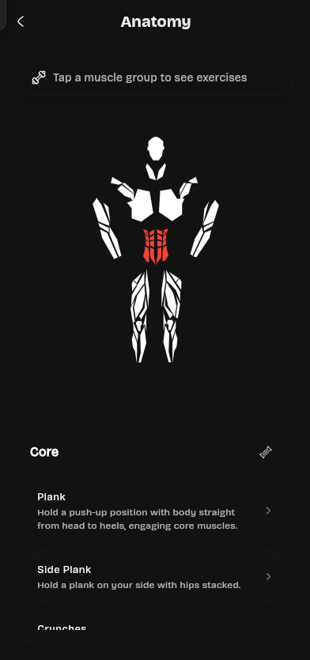

# Fana

A Flutter-based fitness and wellness app that brings together calorie tracking, habits, workouts, and analytics in one place.

## Features
- Calorie tracking with meal logging and portion-based nutrition
- Food search powered by a local database and Open Food Facts fallback
- Macro breakdowns and daily/weekly calorie analytics
- Habit tracking with streak history and progress views
- Workout planning with exercise details and dashboards
- Anatomy and muscle visualization to guide training
- Offline-first local storage for fast access

## Tech Stack
- Flutter + Dart
- Hive + Shared Preferences (local storage)
- Provider (state management)
- Open Food Facts (food search fallback)

## Screenshots






## Setup
1. Install Flutter and set up your environment.
2. Install dependencies:

```bash
flutter pub get
```

3. Run the app:

```bash
flutter run
```

## Build
Build a release APK:

```bash
flutter build apk --release
```

## Release Workflow (GitHub Actions)
This repo includes an automated release workflow that builds and attaches the APK to a GitHub Release when you push a version tag.

1. Commit your changes.
2. Tag a release and push the tag:

```bash
git tag v1.0.0
git push origin main --tags
```

The workflow will publish `fana-vX.Y.Z.apk` to the GitHub Release.

## Notes
- Android release builds are currently signed with debug keys. For Play Store distribution, add a release keystore and update signing config.
